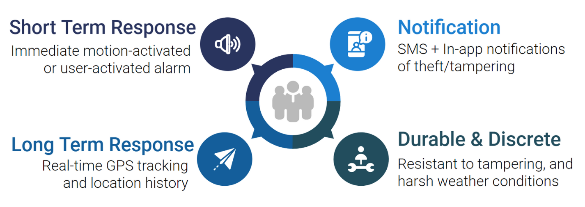
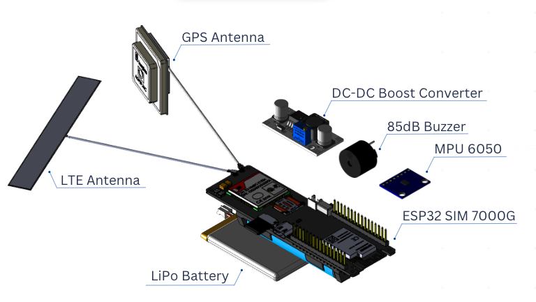

# Sentinel


--------------------------------------------------------------------------------

# Our Mission
Bike theft around the world has become a serious issue in need of addressing. Sentinel, a guardian who stands and keeps watch, is reflective of our mission statement to empower bike owners in safeguarding their bikes.



# Product Overview
* Motion detection
    * Motion detection using MPU6050 IMU
    * User-adjustable motion sensitivity
* Battery
    * 60 hours of battery life
    * Rechargeable battery with USB-C
* Networking and Communication
    * Integrated LTE cellular connection
    * MQTT publish-subscribe communication 
* Location tracking
    * GPS with 10m accuracy
    * Location triangulation using cell tower and wifi nodes
* Deterrence
    * Motion or user-activated 85 dB alarm
    * Stealth push notifications to users


# Hardware



# Getting started
## Embedded Software.
Refer to the [setup guide][embedded-read-me] in the embedded section.

# Software Architecture
Our backend consists of a single service deployed with AWS EC2 and it serves requests made by our embedded device and mobile app. The server is responsible for provisioning AWS SNS for push/SMS events, retrieving and modifying data in our MongoDB database (also deployed in AWS), and serving requests made by our mobile app and embedded device. 

Our database schema reflects a 1-to-1 relationship for mobile apps and embedded devices, and store relevant authentication and identification data for managing real-time events and alerts. HiveMQ is used to send and receive MQTT emits for event-driven communication with the bike tag device. This design handles various event and state changes such as bike alarm warnings and alarms, lock/unlock, manual alarm triggers, etc.


# External Services
We make use of several external services/ APIs. API keys may be needed for the following services:
* [MongoDB][mongodb]
* [AWS][aws]
    * EC2
    * SNS
* Google Cloud
    * [Geolocation API][geolocation]
* [HiveMQ Cloud][hivemq]
* [Maps Geocode][geocode]

# Setup and Deployment 
Any instance types with support for npm will work. For our use case, a T2 micro instance met our requirements.
## Setup on local computer or EC2 instance
### Installing dependencies
```
curl -o- https://raw.githubusercontent.com/nvm-sh/nvm/v0.39.3/install.sh | bash
source ~/.bashrc
nvm install 19.4.0
git clone https://github.com/Sentinel-IGEN/sentinel.git
cd sentinel/backend
npm i
```

## Deployment on EC2 instance
We use [pm2][pm2-page] to spawn and manage daemon processes.
### Installation
```
npm install pm2 -g
```
### Starting daemon
```
pm2 --name Sentinel start npm -- start
```
### Listing processes
```
pm2 ps
```
### Terminating processes
```
pm2 delete 0
```
### View logs
```
pm2 logs
```

[embedded-read-me]:embedded/README.md
[mongodb]: https://www.mongodb.com/
[aws]: https://aws.amazon.com/
[geolocation]: https://developers.google.com/maps/documentation/geolocation/overview
[hivemq]: https://www.hivemq.com/mqtt-cloud-broker/
[geocode]:https://geocode.maps.co/
[pm2-page]:https://pm2.keymetrics.io/